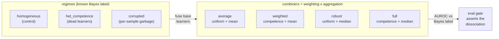

# EnsembleKit

[](https://ensemblekit.dexdevs.com)

> **▶ Live demo: [ensemblekit.dexdevs.com](https://ensemblekit.dexdevs.com)** — run it in your browser, free offline backend. Browse all 10 portfolio demos via the *all demos* link.

[](https://github.com/ranafaraz/EnsembleKit/actions/workflows/ci.yml)
[](https://github.com/ranafaraz/EnsembleKit)
[](LICENSE)

**A benchmark for *when* ensembling helps and *which* combining trick buys *which* kind of
robustness.** EnsembleKit synthesizes base-learner predictions as log-odds of a *known* Bayes
label, then scores ensemble combiners on how well they recover it. The result is a clean 2×2
dissociation: **competence weighting and robust aggregation each buy robustness to a different
failure mode, and you need both** — a few dead learners break a uniform average, intermittent
per-sample corruption breaks any fixed-weight combiner, and a control regime proves each
collapse comes from the missing ingredient, not the combiner in general.

> Why it matters: "average your models" is folklore that quietly fails in two opposite ways —
> when your learners differ in *competence* (weighting matters) and when they are *corrupted on
> some inputs* (robust aggregation matters). EnsembleKit turns that folklore into a measured,
> reproducible result against a known answer — no models to train, no datasets, no API keys.

## Demo


```console
$ ensemblekit compare --regime het_competence    # one strong learner among dead ones
  single    AUROC=0.811
  average   AUROC=0.706    # uniform mean drowns the strong learner
  weighted  AUROC=0.808    # competence weighting recovers it
  robust    AUROC=0.562    # a plain median is worse — most learners are noise
  full      AUROC=0.811

$ ensemblekit compare --regime corrupted         # each learner garbage on some samples
  single    AUROC=0.623
  average   AUROC=0.669    # the mean is dragged off by per-sample outliers
  weighted  AUROC=0.670    # a fixed weight can't reject an intermittently-broken learner
  robust    AUROC=0.781    # a per-sample median rejects them
  full      AUROC=0.782
```

## How it works

A latent score `s` *is* the Bayes log-odds; the label is `y ~ Bernoulli(sigmoid(BETA·s))`. Each
base learner reports a noisy, gained view `z_k = a_k·s + noise`. A combiner fuses the learners'
log-odds into one score, graded by AUROC against `y`. Combiners are the four corners of a 2×2 —
**weighting** × **aggregation** — plus the best single learner as a baseline:



- **weighting** — `uniform` trusts every learner equally; **`competence`** weights each learner
  by its holdout ranking skill, so dead learners are down-weighted. This is the ingredient that
  survives *heterogeneous competence*.
- **aggregation** — `mean` averages the (weighted) log-odds; **`median`** takes the (weighted)
  per-sample median. A fixed weight cannot reject a learner that is garbage on only *some*
  samples, but a per-sample order statistic can — so the median is the ingredient that survives
  *intermittent corruption*.

## Results

Mean AUROC over 16 seeds, 1600 samples/cell, against the known Bayes label
(chance = 0.5; the Bayes ceiling here is ~0.80). Reproduce with `python -m evals.harness`.

| combiner | ingredients | homogeneous (control) | het_competence | corrupted |
|---|---|--:|--:|--:|
| single | baseline | 0.759 | 0.789 | 0.635 |
| average | uniform + mean | 0.801 | **0.713** ⤵ | **0.668** ⤵ |
| weighted | competence + mean | 0.801 | 0.789 | **0.668** ⤵ |
| robust | uniform + median | 0.797 | **0.586** ⤵ | 0.770 |
| **full** | **competence + median** | **0.794** | **0.789** | **0.766** |

- **Effect 1 — competence weighting beats heterogeneous competence.** With one strong learner
  among dead ones, the uniform combiners drop (`average` `0.801 → 0.713`, `robust` `0.797 →
  0.586`); the competence-weighted combiners stay `0.789`.
- **Effect 2 — robust aggregation beats intermittent corruption.** With each learner garbage on
  a random per-sample fraction, the mean combiners drop (`average` `→ 0.668`, `weighted` `→
  0.668`); the median combiners stay `~0.77`.
- **Each ablation fails only its own regime**, and `average` (neither ingredient) fails on both —
  so only `full` is robust everywhere. The collapse is the missing ingredient, not the combiner.
- **Scrambled-label null:** shuffle the ground truth and every combiner falls to ~0.50,
  confirming the AUROC is real (full table in [`evals/RESULTS.md`](evals/RESULTS.md)).

### Why ensemble at all? Diversity sweep

In `homogeneous` every learner is equally good, so the only thing that makes the ensemble beat
the best single learner is **diversity**. As the learners' errors become correlated (`rho → 1`,
identical learners) the ensemble gain collapses to zero — the canonical control for why
ensembling helps:

| error correlation `rho` | 0.00 | 0.30 | 0.60 | 0.90 | 0.99 |
|---|--:|--:|--:|--:|--:|
| gain (average − best single) | **+0.041** | +0.029 | +0.015 | +0.004 | **+0.001** |

## Quickstart

```bash
pip install -e ".[dev]"          # numpy only; no API keys, no downloads

ensemblekit compare --regime het_competence    # all combiners on one regime
ensemblekit compare --regime corrupted
ensemblekit regimes              # the full combiner x regime table (the 2x2)
ensemblekit diversity            # ensemble gain vs error correlation rho

python -m evals.harness          # write evals/RESULTS.md
python -m evals.gate             # assert the dissociation (CI gate)
pytest -q                        # 76 tests
```

Configure via env vars (see [`.env.example`](.env.example)): `ENSEMBLEKIT_COMBINER`,
`ENSEMBLEKIT_REGIME`, `ENSEMBLEKIT_LABELS`, `ENSEMBLEKIT_SAMPLES`, `ENSEMBLEKIT_RHO`,
`ENSEMBLEKIT_SEED`.

### Docker

```bash
docker build -t ensemblekit .
docker run --rm ensemblekit       # runs the full offline benchmark
```

### Optional: scikit-learn cross-check

```bash
pip install -e ".[sklearn]"       # then the skipped tests run
```

Recomputes the AUROC with `sklearn.metrics.roc_auc_score` on the exact combined scores and
asserts it matches the hand-rolled numpy core.

## Design notes

- **Offline & deterministic.** numpy is the only runtime dependency; every number is produced
  from `np.random.default_rng` with a fixed salt, so CI reproduces the table bit-for-bit across
  Python 3.10–3.12.
- **Synthesized, not trained.** Base learners are noisy views of a known Bayes signal — the
  ground truth and the achievable ceiling are exact, with no dataset and no "is this label
  right?" ambiguity. A regime changes only the learner *pathology*, never the labels.
- **The axes are genuinely orthogonal.** Competence weighting handles consistently-weak
  learners; a per-sample median handles intermittently-corrupted ones. Neither can do the
  other's job, which is what makes the 2×2 a true dissociation rather than two views of one fix.
- **The experiment is tuned, never the combiner.** Regime strengths are chosen to make each
  collapse visible; the combiners are textbook (uniform/weighted mean, median, weighted median).

See [`docs/ARCHITECTURE.md`](docs/ARCHITECTURE.md) and [`docs/DECISIONS.md`](docs/DECISIONS.md)
for the full design.

## License

MIT — see [LICENSE](LICENSE).
